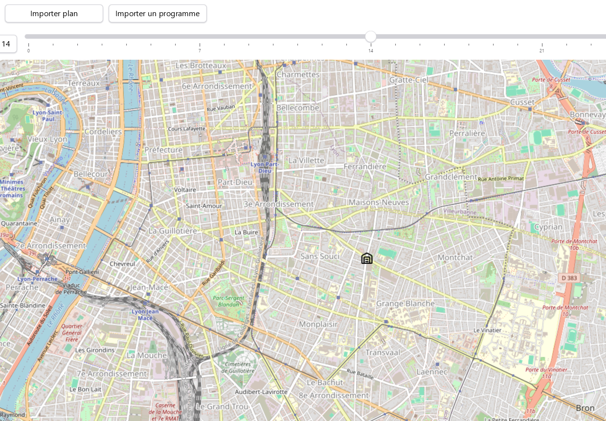
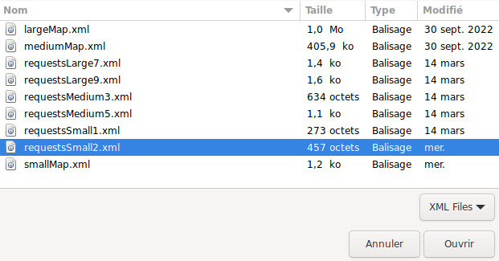
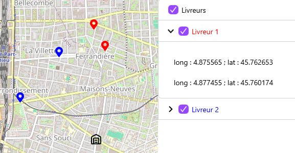
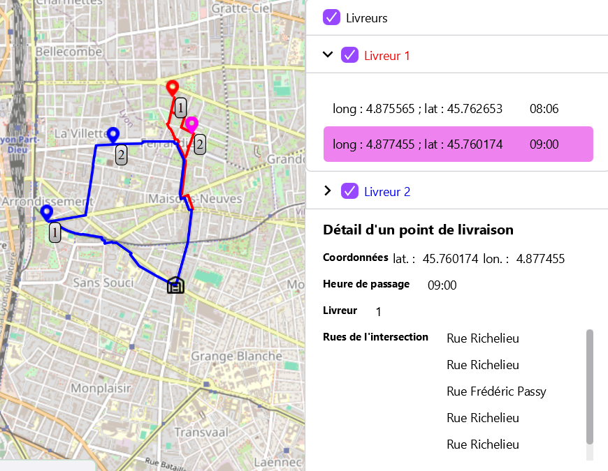

# GeoFast - Manuel pour les utilisateurs

## <a id="partie1"/>1. Importer un plan


Cette fonctionnalité permet de charger un plan à partir d’un fichier xml.

Après avoir cliquer sur le bouton, vous devez selectionner le fichier xml.


Le fichier xml doit être semblable à ce qui suit : <a id="xmlplan"></a>

```xml
<?xml version="1.0" encoding="UTF-8" standalone="no"?>
<map>
<warehouse address="25303831"/>
<intersection id="25303831" latitude="45.74979" longitude="4.87572"/>
<intersection id="342873532" latitude="45.76051" longitude="4.8783274"/>
<intersection id="208769499" latitude="45.760597" longitude="4.87622"/>
<intersection id="975886496" latitude="45.756874" longitude="4.8574047"/>
<segment destination="975886496" length="51.028988" name="Impasse Lafontaine" origin="342873532"/>
<segment destination="342873532" length="51.028988" name="Impasse Lafontaine" origin="975886496"/>
<segment destination="208769499" length="106.73056" name="Rue Frédéric Passy" origin="208769499"/>
<segment destination="208769499" length="96.57731" name="Rue Édouard Aynard" origin="975886496"/>
<segment destination="342873532" length="64.89446" name="Rue Feuillat" origin="25303831"/>
<segment destination="208769499" length="153.72511" name="Rue Feuillat" origin="25303831"/>
<segment destination="975886496" length="122.619156" name="Rue Bara" origin="25303831"/>
<segment destination="25303831" length="118.890465" name="Avenue Lacassagne" origin="975886496"/>
</map>
```
Une fois le plan chargé, le warehouse s'affiche sur la carte et le bouton importer un programme apparait.



## <a id="partie2"/>2. Importer un programme de livraison


Cette fonctionnalité permet de charger un programme de livraison à partir d’un fichier xml.
Au préalable, vous devez avoir importé un plan ([voir partie 1](#xmlplan))

Après avoir cliqué sur le bouton, vous devez selectionner le fichier xml.



Le fichier xml doit être semblable à ce qui suit :

```xml
<?xml version="1.0" encoding="UTF-8" standalone="no"?>
<planningRequest>
  <request courier="1" deliveryAddress="342873532" deliveryDuration="600" deliveryTime="9"/>
  <request courier="2" deliveryAddress="208769499" deliveryDuration="480" deliveryTime="9"/>
  <request courier="1" deliveryAddress="208769499" deliveryDuration="600" deliveryTime="8"/>
  <request courier="2" deliveryAddress="975886496" deliveryDuration="480" deliveryTime="10"/>
</planningRequest>
```

les "deliveryAddress" doivent correspondre au "id" des intersections du [plan](#xmlplan).

Une fois le programme chargé, les points de livraison de chaque livreur sont visibles sur la carte et sur la partie droite de l'interface.



De plus, le menu de droite est mis à jour. Il affiche chaque livreur ainsi que ses points de livraison
dans une liste déroulante.

## <a id="partie3"/>3. Calculer les tournées d'un programme de livraison


Cette fonctionnalité permet de lancer le calcul des tournées de chaque livreur.
Au préalable, vous devez avoir importé un programme de livraison ([voir partie 2](#partie2)).

Quand le calcul est terminé, le trajet de livraison de chaque livreur apparait sur la carte.
Les points de livraison sont ordonnés et le trajet est mis en couleur.



Vous pouvez afficher ou cacher les tournées de livraison des livreurs grâce au checkboxes.

## <a id="partie4"/>4. Export des tournées de livraison au format pdf


Cette fonctionnalité permet d'exporter les tournées de livraison dans un fichier pdf.

Au préalable, vous devez avoir calculer les tournées d'un programme de livraison ([voir partie 3](#partie3)).

Le fichier PDF généré contiendra la liste de route de chaque livreur.

